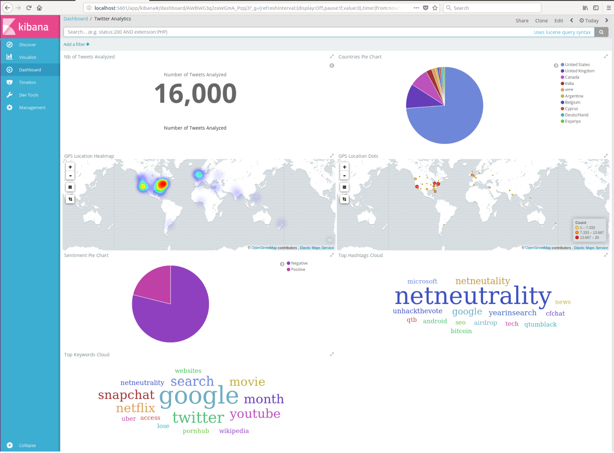

Kafka Consumer Class
==============

Behavior:
--------------

- Subscribe to Kafka topic.
- Process data (tweets) using Apache Flink streaming.
- Compute several KPI of brand monitoring
- Store results into ElasticSearch.
- Display data in Kibana

